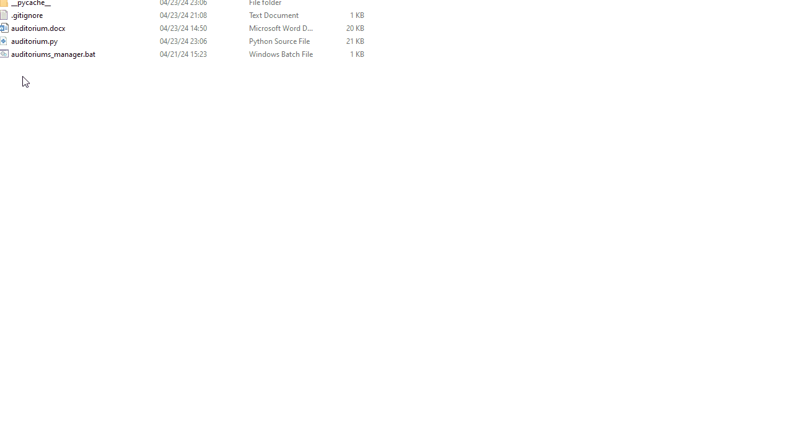

*last updated on April 28, 2024 - Python 3.10.2*

# Auditorium Manager for the poor v1.0
This is a little project (well, big enough to type) to show:
- how to create a terminal interface
- how to create menus using *while loops* WITHOUT calling functions INSIDE the loops
- how to call functions
- a way to handle a simple JSON database by creating it (if it doesn't exist) and updating it in the C.R.U.D. way (no, that's not a Marvel team)

There is nothing fancy and the rows are all in the middle (no aisles or anything like that). What you can do:
- Create / delete rows of up to 234 seats (9 lines (sub-rows) of 26 seats each)
- Choose the position of the row you are adding, which will "move" the other existing rows (if any)
- Rename an auditorium. I didn't add constraints, so duplicates are possible
- Book / unbook (= free) seats
- Add / remove seats
- Choose the position of the seat you are adding (like rows)
- Go back to previous menus

# Preview (out of date since April 28, must make a new one)

# Pre-requisites
- Not a PC running on MacOS. The rich don't use GitHub, and I'm sorry to see you ended up getting lost here. Now go back to your $3.5k VR goggles.
- Python (3.10.2+)
- That's pretty much it!
- Provided without the JSON file on purpose. It will automatically be created upon the first launch.
- The *.bat file is to quickly launch the script on Windows (and get all your IDs and passwords, but keep that a secret, pleaaase!).

Clone that repo or simply download it and extract the file if, like me, you're annoyed with always cloning repositories instead of cute 100-dollar bills.

Any bugs? Please report them (ideally not to me, but hey... if you don't care about making me very sad, then do so).

# Updates (date = commit date)
*April 28, 2024*
- Some refactoring
- Changed the limit of numbers of seats for a row from 26 to 234 (26 * 9). A row is now up to 9 lines of 26 seats (A1, B1, ..., Z1, A2, ..., Z2, ... Z9). 
- Changed the display of the rows by adding the place of each seat (A1, A2, etc.), and below its availability (O or X).